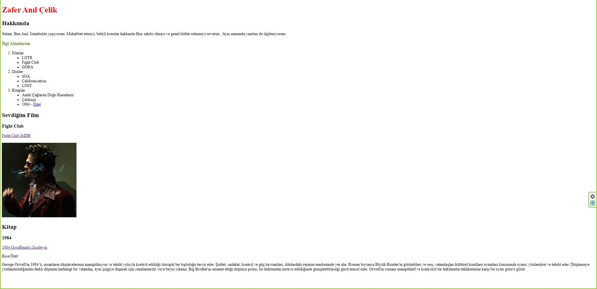

## HTML ÖDEV-2
Kodluyoruz Front End Web Geliştirme eğitiminin ikinci HTML ödevi
Ödev internet sayfasında ki örneğe uygun olarak basit bir şekilde hazırlanmıştır .
Ödevde yalnızca temel etiketler kullanıldı. Ufak da olsa CSS etiketleri de eklendi 

-------

### Site Görünümü

